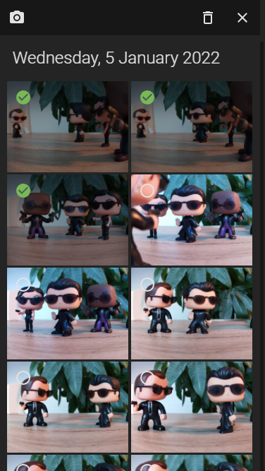
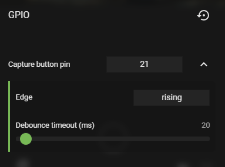
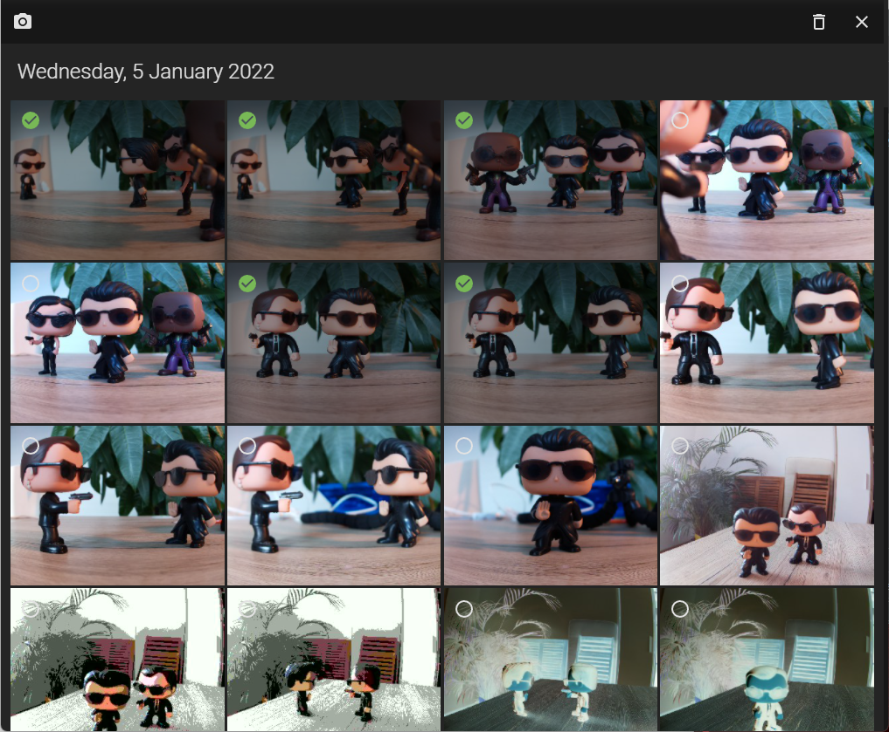
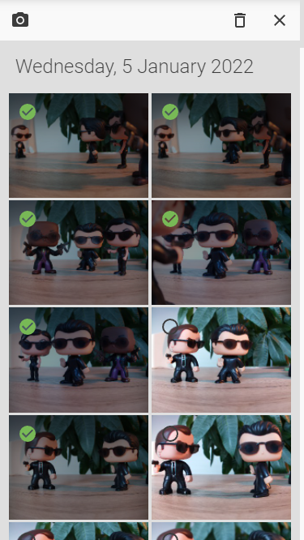

# 📷 RaspiCam

RaspiCam is a react application to stream, take pictures or record videos from your raspberry pi camera over a web interface.

- **Simple**: a mobile-first designed user interface to provide a flawless user experience on the smartphone.
- **Lightweight**: raspiCam uses the build-in libcamera-still and libcamera-vid to stream, capture and record videos.

## Usecases

- Monitoring camera
- Timelapse photography
- Video recorder
- Camera to go with trigger (GPIO button or smartphone)
- Use it as a tool to find the best camera settings for your project.
  - Adjust the settings without manually start and stop the libcamera-vid or libcamera-still.
  - Copy the result from the terminal and use it for your project.
- MJPEG stream
  - for external applications like octoprint (not tested)
  - alternative for devices without media source extension
  - http://ip_address:8000/api/stream/mjpeg

## Hardware

I'm using a **Raspberry PI Zero W** with a **Raspberry PI HQ camera**.

You can find the 3d printing files on https://www.prusaprinters.org/prints/48519-raspberry-pi-zero-webcam-hq-camera


If you prefer a **Raspberry PI4**:
https://www.prusaprinters.org/prints/61556-raspberry-pi4-hq-camera-aluminium-mix

## Screenshots




# Installation

## Raspberry PI OS

From version >1.2.0, raspiCam support the libcamera apps of the new Raspberry Pi OS. If you use an older version with raspistill and raspivid, please check version 1.2.0 in the release section.

If your raspberry is already up and running, you can skip this section and continue with the "Install Node.js" section.

Install the latest Raspberry Pi OS Lite with the [Raspberry PI imager](https://www.raspberrypi.org/software/). Feel free to use the desktop version, but it's not necessary for the application.

Usefull links:

- [Headless setup](https://www.tomshardware.com/reviews/raspberry-pi-headless-setup-how-to,6028.html)
- [Install camera](https://raspberrytips.com/install-camera-raspberry-pi/)

### Update

After the installation, make sure your system is up to date:

```
sudo apt update
sudo apt upgrade
```

## Install Node.js

### Raspberry PI 4

Enable the NodeSource repository by running the following command in your terminal:

```
curl -sL https://deb.nodesource.com/setup_14.x | sudo bash -
sudo apt install nodejs
```

### Raspberry PI Zero W

The latest versions of node doesn't provide a armv61 version.
The last LTS version i could find was v10.24.0.

```
curl -o node-v10.24.0-linux-armv6l.tar.gz https://nodejs.org/download/release/v10.24.0/node-v10.24.0-linux-armv6l.tar.gz
tar -xzf node-v10.24.0-linux-armv6l.tar.gz
sudo cp -r node-v10.24.0-linux-armv6l/* /usr/local/

sudo reboot
```

### Check the node installation

To verify the installation, run the following command to print the installed node version.

```
node --version
```

## Install RaspiCam

### Dependencies

exiv2 is used to extract the thumbnails from the photos.

```
sudo apt install exiv2
```

### RaspiCam

Download the latest release and extract it to a new raspiCam folder.

```
mkdir raspiCam && cd raspiCam
wget https://github.com/Lillifee/raspiCam/releases/latest/download/raspiCam.tar.gz
tar -xvzf raspiCam.tar.gz
```

<details>
  <summary>Alternative: Clone the repository and build it</summary>
    Clone the repository and build the package:

    ```
    git clone https://github.com/Lillifee/raspiCam.git

    cd raspiCam/

    npm install
    npm run build
    ```
    The bundled package should appear in the **build** folder.

</details>

##

# Run RaspiCam

Change to the raspiCam or build folder and start the server:

```
node server.js
```

As soon the server is up and running, the following message appear:

`[server] server listening on 8000`

Open the browser and navigate to: `http://__ip_address__:8000`

# Run RaspiCam as a service

To automatically start the RaspiCam on startup, you can run the RaspiCam as a service.
Check the [raspicam.service](https://github.com/Lillifee/raspiCam/blob/master/systemd/raspicam.service) in the systemd folder in the repository and adapt it to your needs.

Copy the raspicam.service file to the systemd:

```
sudo cp raspicam.service /etc/systemd/system
```

Enable and start the raspicam service:

```
sudo systemctl enable raspicam.service
sudo systemctl start raspicam.service
```

If you encounter problems (e.g.: the server doesn't start), check the logs:

```
journalctl -u raspicam
```

Or stop and disable the service:

```
sudo systemctl disable raspicam.service
sudo systemctl stop raspicam.service
```

# GPIO

RaspiCam supports triggering an image/video using a [GPIO pin](https://www.raspberrypi.com/documentation/computers/raspberry-pi.html#gpio-and-the-40-pin-header).

Not all GPIO pins are suitable to use as a capture trigger. I would suggest starting with a GPIO pin without additional usage like GPIO 17, 27 22, etc.



# Tipps

You can also check the following [article](https://dev.to/bogdaaamn/run-your-nodejs-application-on-a-headless-raspberry-pi-4jnn) to run the raspiCam headless. It includes a step by step instruction for:

- [PM2](https://github.com/Unitech/pm2) - Autostart the process
- [NGINX](https://docs.nginx.com/nginx/admin-guide/web-server/reverse-proxy/) - Reverse proxy to run raspiCam on port 80

# Credits

- [JMuxer](https://github.com/samirkumardas/jmuxer).
- [Broadway h264 player](https://github.com/mbebenita/Broadway).

# Troubleshooting

**Slow live stream**

- Check the WIFI connection
- Close the web developer tools
- Increase the quality compensation in the settings

Found a bug? Don't hesitate to create a new issue.

Please add your running setting to the ticket.
You can find the latest command sent to raspiCam in the terminal output:

**HINT** If you found the right settings for your project, you can simple copy the command from there.


# Screenshots




# Theme




# Roadmap and ideas

## Settings

- Search settings
- Setting explanation

## Gallery

- group timelapse photos
- download multiple items (zip)

## Keywords

jmuxer web application raspberry hq camera software react live player node.js raspberry pi stream h264 monitoring timelapse video recording capture libcamera-vid libcamera-still libcamera-app bullseye raspicam
