# 📷 RaspiCam

RaspiCam is a react application to stream, take pictures or record videos from your raspberry pi camera over a web interface. The live stream is provided over a simple HTTP request and displayed by the brilliant [Broadway h264 player](https://github.com/mbebenita/Broadway).

- **Simple**: a mobile-first designed user interface to provide a flawless user experience on the smartphone.
- **Lightweight**: raspiCam uses the build-in raspistill and raspivid to stream, capture and record videos.

## Usecases
- Monitoring camera
- Timelapse photography
- Video recorder
- Camera to go with remote trigger (smartphone)
- Use it as a tool to find the best camera settings for your project.
    - Adjust the settings without manually start and stop the raspivid or raspistill.
    - Copy the result from the terminal and use it for your project.

## Hardware
I'm using a **Raspberry PI Zero W** with a **Raspberry PI HQ camera**.

You can find the 3d printing files on https://www.prusaprinters.org/prints/48519-raspberry-pi-zero-webcam-hq-camera

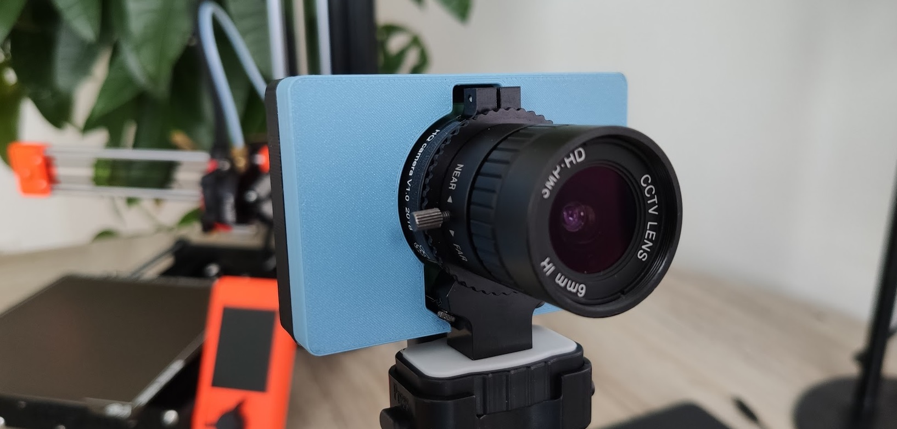

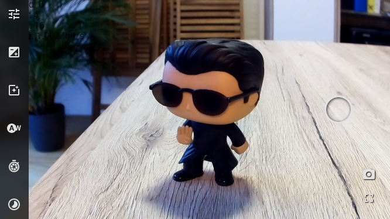

# Installation

## Raspberry PI OS

If your raspberry is already up and running, you can skip this section and continue with the "Install Node.js" section. 

Install the latest Raspberry Pi OS Lite with the [Raspberry PI imager](https://www.raspberrypi.org/software/). Feel free to use the desktop version, but it's not necessary for the application.  

Usefull links:
- [Headless setup](https://www.tomshardware.com/reviews/raspberry-pi-headless-setup-how-to,6028.html)
- [Install camera](https://raspberrytips.com/install-camera-raspberry-pi/)

### Update

After the installation, make sure your system is up to date:
```
sudo apt update
sudo apt upgrade
```

### Enable camera

Enable the camera in the raspi-config: "**Interfacing options**" -> "**Camera**":
```
sudo raspi-config
```


## Install Node.js

Enable the NodeSource repository by running the following command in your terminal:
```
curl -sL https://deb.nodesource.com/setup_14.x | sudo bash -
sudo apt install nodejs
```

### Raspberry PI Zero W

The latest versions of node doesn't provide a armv61 version.
The last LTS version i could find was v10.24.0. 

```
curl -o node-v10.24.0-linux-armv6l.tar.gz https://nodejs.org/download/release/v10.24.0/node-v10.24.0-linux-armv6l.tar.gz
tar -xzf node-v10.24.0-linux-armv6l.tar.gz
sudo cp -r node-v10.24.0-linux-armv6l/* /usr/local/

sudo reboot
```


### Check the node installation
To verify the installation, run the following command to print the installed node version.

```
node --version
```

## Install RaspiCam

### Dependencies

exiv2 is used to extract the thumbnails from the photos.
```
sudo apt install exiv2
```

### RaspiCam

Clone the repository, install and build the raspiCam can take a while.
Especially on the zero, I would suggest the copy approach.

Copy the **build** folder from this repository to your Raspberry PI.

or

Clone the repository and build the package: 

```
git clone https://github.com/Lillifee/raspiCam.git

cd raspiCam/

npm install
npm run build
```

## 

# Run RaspiCam

Change to the raspiCam folder and start the server:

```
node build/server.js
```

Wait until the following message appears:

` [server] server listening on 8000 `

Open the browser and navigate to: `http://__ip_address__:8000`

# Tipps

Check the following [article](https://dev.to/bogdaaamn/run-your-nodejs-application-on-a-headless-raspberry-pi-4jnn) to run the raspiCam headless. It includes a step by step instruction for:

- [PM2](https://github.com/Unitech/pm2) - Autostart the process
- [NGINX](https://docs.nginx.com/nginx/admin-guide/web-server/reverse-proxy/) - Reverse proxy to run raspiCam on port 80

# Troubleshooting

**Slow live stream**
- Check the WIFI connection 
- Close the web developer tools
- Increase the quality compensation in the settings


# Credits
- [Broadway h264 player](https://github.com/mbebenita/Broadway).

# Screenshots

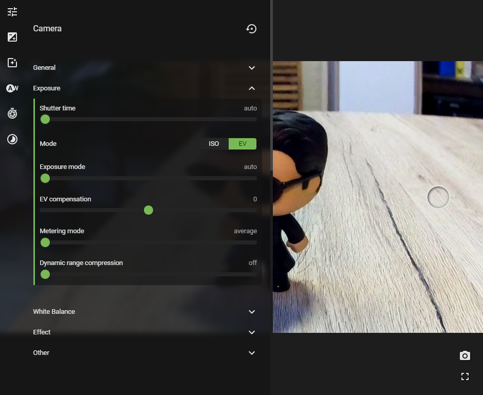


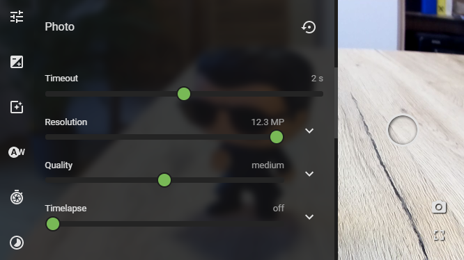

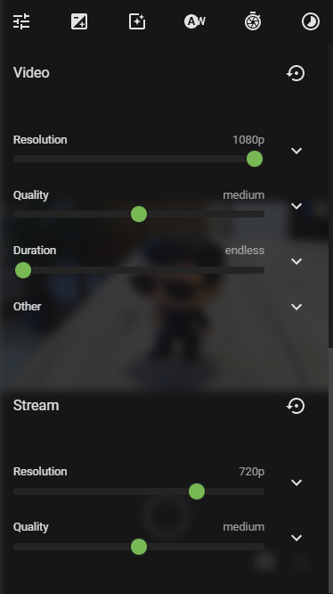

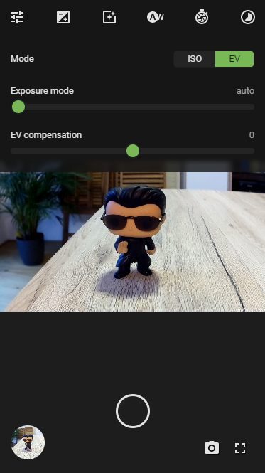

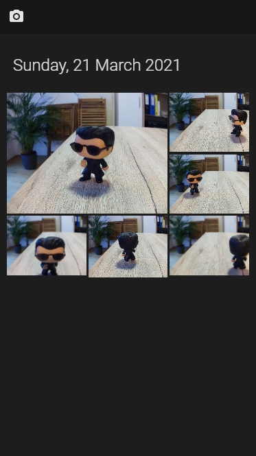


## Settings


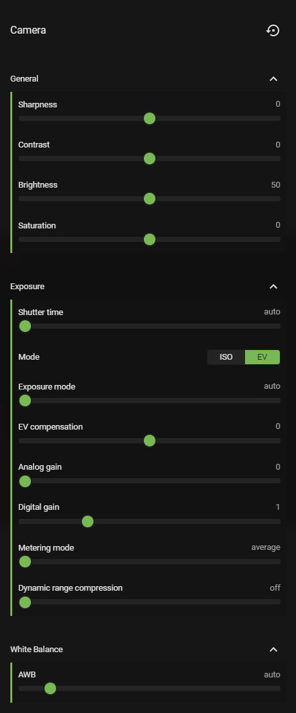

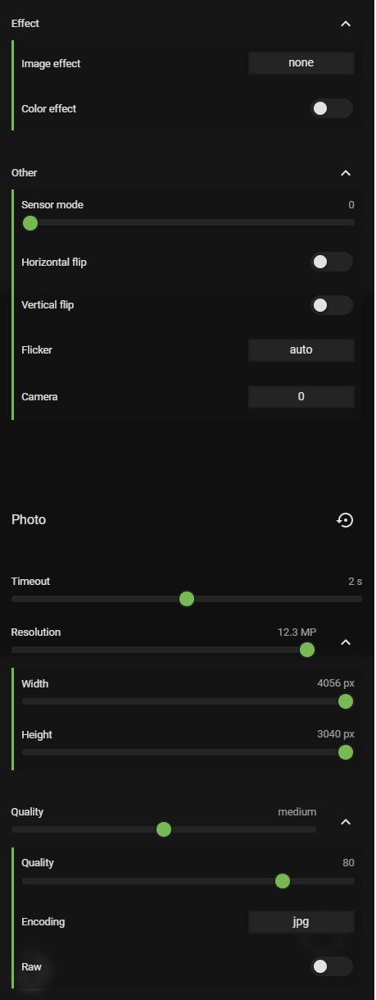

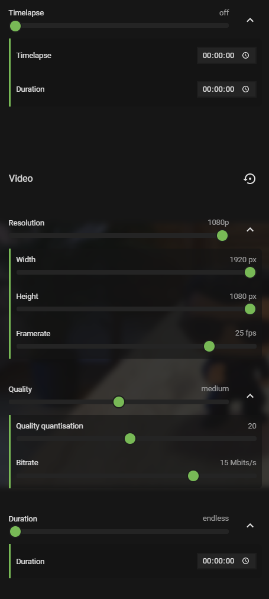

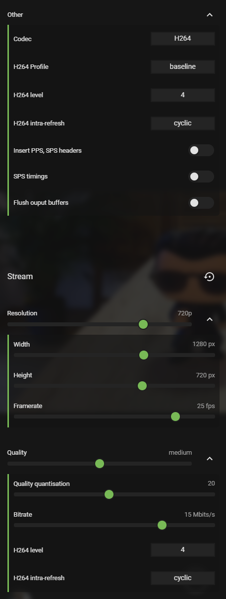


# Roadmap and ideas

## Stream
 - Investigate MJPEG stream
    - Stream could be used for other applications e.g. Octoprint

## Settings
 - Preview settings
 - Search settings
 - Setting explanation 

## Gallery
 - sort order
 - loading indication
 - support videos
 - group timelapse photos
 - select and delete items
 - download multiple items (zip)

## Keywords
broadway live player node.js raspberry pi stream h264 monitoring timelapse video recording capture raspivid raspistill